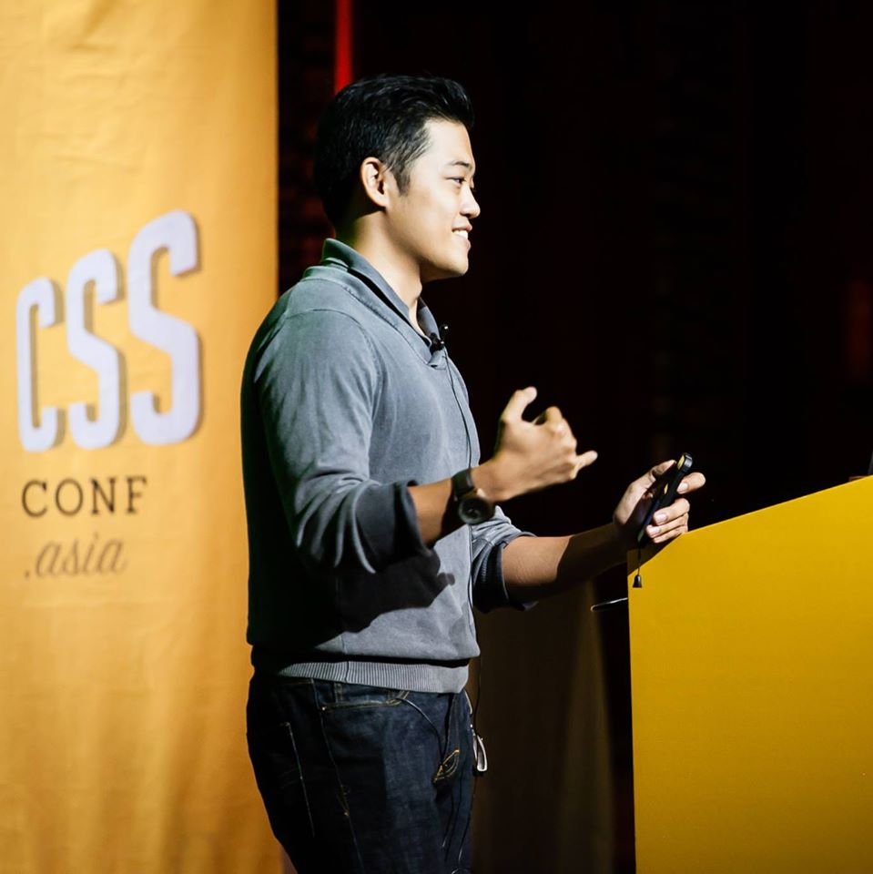

**Rico Sta. Cruz** 
Open Source Developer, [Mashup Garage]

Rico Sta. Cruz is the developer behind many popular open source 
JavaScript libraries in use today. He is one of the [top contributors] at 
GitHub, previously hosted of [JSConf Asia], and organized the Philippine 
JavaScript community [Manila.js]. Today, he's the Chief Creative Officer at [Mashup Garage].

* __Site:__ [ricostacruz.com]
* __Twitter:__ [@rstacruz](https://twitter.com/rstacruz)
* __GitHub:__ [rstacruz](https://github.com/rstacruz)
* __Picture:__ [here](images/picture3.jpg)

[top contributors]: http://git.io/top
[ricostacruz.com]: http://ricostacruz.com
[Manila.js]: http://manilajs.com
[Nadarei]: http://nadarei.co
[JSConf Asia]: http://2013.jsconf.asia
[Mashup Garage]: http://www.mashupgarage.com
